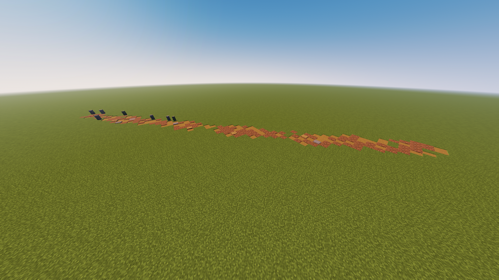
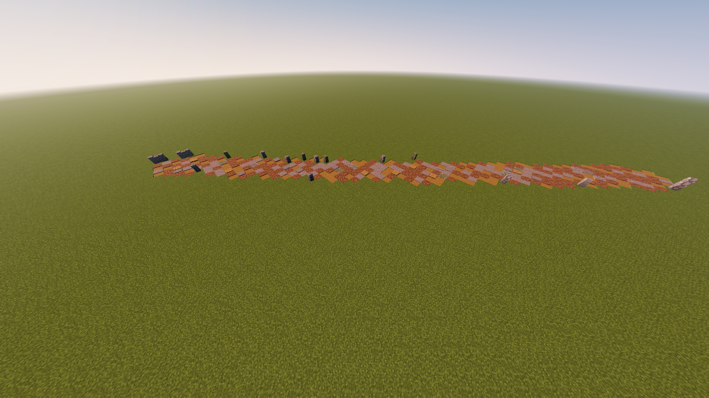
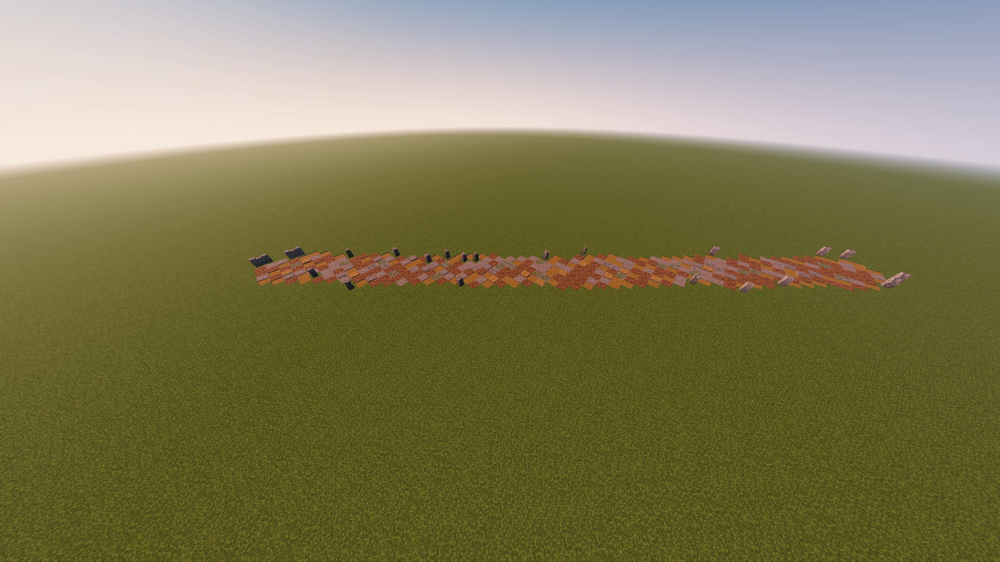

# RoadForge

Roads that build themselves — organically, block by block, from the ground up.

RoadForge tracks where players walk and gradually transforms the terrain beneath their feet. A dirt path worn down by foot traffic becomes gravel. Gravel becomes cobblestone. Cobblestone becomes stone bricks. No commands, no tools, no player input. Just walk.

---

## Screenshots

<p align="center">
  
  
  
</p>

*Left to right: early dirt path forming → gravel and cobblestone taking shape → a mature road with stone bricks, walls, and mixed materials*

---

## How it works

Every block a player steps on accumulates traffic points. When a block crosses a threshold, it upgrades to the next tier. Blocks that go unused slowly decay back. Two separate roads that drift within range of each other gradually merge into one via A* pathfinding.

**Upgrade path:**

```
Grass / Dirt  →  Dirt Path  →  Gravel  →  Cobblestone  →  Stone Bricks  →  Smooth Stone
```

Each tier has weighted material variants (mossy cobblestone, cracked stone bricks, smooth basalt, etc.) and 18% of blocks randomly freeze at their current tier — keeping roads looking natural and varied instead of uniform.

---

## Features

- **Fully passive** — roads form from real player movement, no commands needed
- **Biome-aware** — sand upgrades differently from stone, snow from grass
- **Road merging** — nearby roads pull toward each other and connect organically
- **Decay** — unused roads slowly degrade over time
- **Side walls** — decorative wall blocks along road edges, configurable chance
- **Block variants** — fully configurable material weights per tier via `config.yml`
- **Overlay blocks** — optional decorative layer on road surface (pressure plates, lanterns, etc.)
- **No drops** — road blocks and walls drop nothing when broken
- **Performance-conscious** — upgrade processing sorted by traffic density, async saves

---

## Requirements

- Paper 1.21.1+
- Java 21

---

## Installation

1. Download the [latest release](https://github.com/<USER>/<REPO>/releases/latest)
2. Drop `RoadForge.jar` into your `plugins/` folder
3. Restart the server
4. Configure `plugins/RoadForge/config.yml` to taste
5. Walk around

---

## Configuration

The config is fully documented. Key values to tune:

| Key | Default | What it does |
|---|---|---|
| `traffic-radius` | `2` | Blocks around player that receive traffic per step |
| `upgrade-interval` | `60` | Seconds between upgrade cycles |
| `thresholds.dirt_path` | `50` | Steps needed to form a dirt path |
| `thresholds.smooth_stone` | `2000` | Steps needed to reach max tier |
| `walls.chance` | `0.10` | Probability of a wall block on each road edge |
| `decay.amount` | `5` | Points lost per decay cycle |
| `merging.max-distance` | `20` | Max gap (blocks) between roads that will merge |

---

## Commands

| Command | Description |
|---|---|
| `/roadforge reload` | Reload config without restart |
| `/roadforge save` | Force save traffic data to disk |
| `/roadforge info` | Show number of tracked blocks |

**Permission:** `roadforge.admin` (op by default)

---

## Project

Part of the [RavensLand](https://github.com/ItsRavensLand) plugin suite.

Built with Paper API · Java 21 · Gradle

---

## License

MIT
